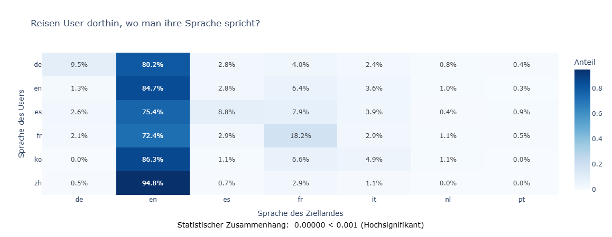

# Travel Behavior & User Analytics (HKA Project)
> A Data Science Consultancy Case for US-based Platform Optimization

## Projektüberblick
Im Rahmen einer Beratungssimulation für eine US-Reisebuchungsplattform analysiert dieses Projekt das Nutzerverhalten, um Marketingstrategien und die Produktplatzierung zu optimieren. Der Fokus liegt auf der Transformation von komplexen Clickstream-Daten in geschäftsrelevante Insights.

## Kernfunktionen
* **Multi-Relational Data Engineering:**
  * Integration und Bereinigung von Teildatensätzen: Nutzerstammdaten, Clickstream-Logs, geografische Infos und Bevölkerungsstatistiken.
  * Preprocessing zur Vorbereitung statistischer Analysen für verschiedene Stakeholder-Gruppen.
* **Statistische Hypothesenprüfung:**
  * **Korrelationsanalysen:** Untersuchung der Zusammenhänge zwischen Nutzerdemografie (Alter/Sprache) und den Eigenschaften der Zielländer.  
  
  *Beispiel: Analyse des Zusammenhangs zwischen Usersprache und Zielsprache.*
  * **Signifikanztests:** Vergleich von Buchungstrends zwischen den Zeiträumen 2010/2011 und 2014/2015 zur Identifikation von Marktveränderungen.
  * **Verhaltensanalyse:** Analyse von Unterschieden im Surfverhalten basierend auf Geschlecht, Alter und verwendetem IT-Equipment.
* **Business Intelligence & Storytelling:**
  * Erstellung von **Data Stories** für das Marketing, um die Durchdringung neuer Geschäftsfelder zu unterstützen.
  * Entwicklung eines interaktiven **Power BI Dashboards** zur Visualisierung von Kennzahlen und Handlungsempfehlungen für das Management.

## Tech Stack
* **Sprache:** Python
* **Statistik & Analyse:** `pandas`, `numpy`, `plotly.express`, `scipy.stats` (Chi-Square, ANOVA, T-Tests)
* **BI-Tool:** Microsoft Power BI (.pbix Datei enthalten)

## Projektherkunft
Dieses Projekt wurde im Rahmen des Moduls **„Datenanalyse und Business Intelligence 1“** an der **Hochschule Karlsruhe (HKA)** im WS 25/26 als Gruppenarbeit entwickelt.  
**Datenquelle:** Anonymisierter akademischer Datensatz einer US-Reiseplattform (bereitgestellt durch die HKA).
